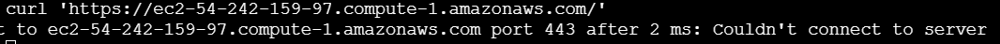

# Configuração AWS

### <b>1. Criar conta na AWS</b>

### <b>2. Ir no console do EC2</b>

    2.1 Criar uma instância

    2.2 Verificar se o DNS IPv4 público está disponível

    2.3 Verificar se existe regra de segurança para SSH, HTTP e HTTPS, caso contrário, adicionar clicando em Grupos de segurança.

### <b>3. Fazer acesso remoto para configurar a aplicação</b>

    3.1 Criar o par de chaves

    3.2 Vai gerar um arquivo com o par de chaves

    3.3 Adicionar o arquivo do par de chaves na pasta root do usuário linux

    3.4 Abrir o cmd do Ubuntu

    3.5 Digitar ssh -i /home/{user}/chave_instancia.pem ec2-user@{DNS IPv4 público} , como não tem nenhum user configurado, esse é o padrão

    3.6 Se for negado, precisa associar o par de chaves a uma instância no AWS

    

    3.7 Mudar o acesso do arquivo: chmod 600 /home/{user}/chave_instancia.pem

    3.8 Coletar a chave pública do pc: ssh-keygen -y -f /home/{user}/chave_instancia.pem

    3.9 Copiar a chave e armazenar no EC2 connect (Conectar na instância)

    3.10 Digitar nano ~/.ssh/authorized_keys => vai abrir um arquivo de texto

    3.11 Adicionar a chave nesse arquivo de texto

    3.12 Tentar novamente fazer o acesso via ssh no Ubuntu ssh -i /home/{user}/chave_instancia.pem ec2-user@{DNS IPv4 público}

### <b>4. Atualizar o ambiente cloud - Ubuntu</b>

    4.1 sudo apt update -y
    4.2 sudo apt upgrade -y

### <b>5. Instalar Apache e configurar primeiro site - Ubuntu</b>

    5.3 sudo apt install apache2 -y (https://ubuntu.com/server/docs/how-to-install-apache2)
    5.4 Habilitar o servidor sudo systemctl start apache2
    5.5 Verificar status sudo systemctl status 'apache2'
    5.6 Habilitar sudo systemctl enable apache2
    5.7 Conexão ainda foi recusada
    5.8 curl 'https://ec2-54-242-159-97.compute-1.amazonaws.com/' 'link de acesso de instancia no navegador'
    5.9 Além da porta 443 habilitar também a 80
    
    5.10 Instalar o modulo ssl => sudo install mod_ssl (no ubuntu já está ok)
    5.11 Verificar configuração sudo nano /etc/apache2/apache2.conf
    5.12 sudo a2enmod ssl caso seja necessario habilitar o ssl
    5.13 reiniciar apache sudo systemctl restart apache2
    5.14 listar todas as conexões sudo netstat -tulnp | grep 443 (instalar sudo apt install net-tools)
    5.13 Vai dar erro no https pq precisa de um certicado assinado, mas vai funcionar no http
    5.14 Criar um site para teste
    5.15 cd / => cd /var/www/html
    5.16 sudo nano index2.html
    5.17 Dar permissão para o html sudo chmod 644 index2.html
    5.18 Reinciar Apache
