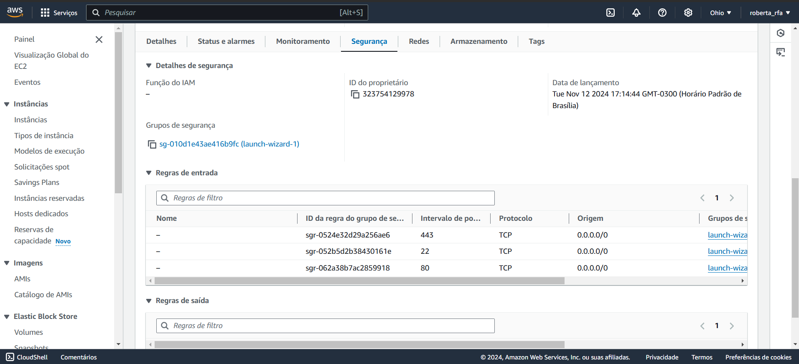
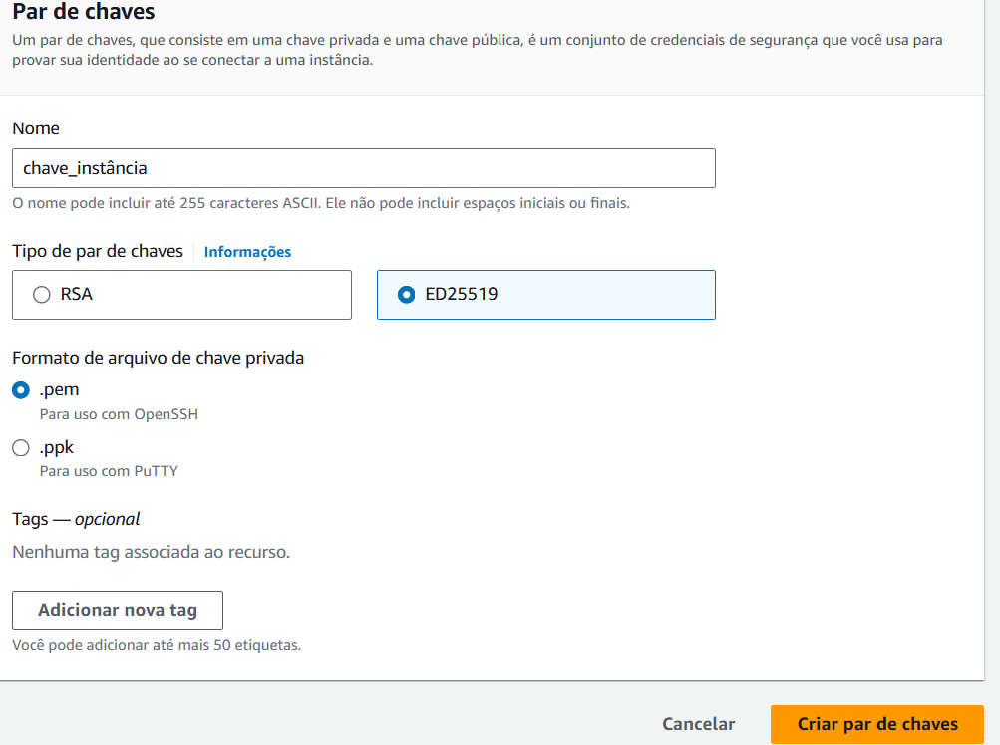
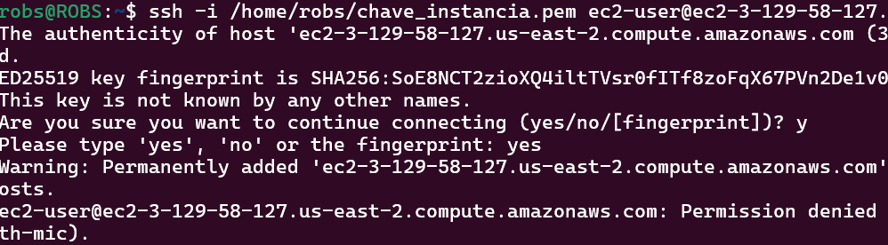

# Configuração AWS

### <b>1. Criar conta na AWS</b>

### <b>2. Ir no console do EC2</b>

    2.1 Criar uma instância

    2.2 Verificar se o DNS IPv4 público está disponível

    2.3 Verificar se existe regra de segurança para SSH, HTTP e HTTPS, caso contrário, adicionar clicando em Grupos de segurança.

### <b>3. Fazer acesso remoto para configurar a aplicação</b>

    3.1 Criar o par de chaves

    3.2 Vai gerar um arquivo com o par de chaves

    3.3 Adicionar o arquivo do par de chaves na pasta root do usuário linux

    3.4 Abrir o cmd do Ubuntu

    3.5 Digitar ssh -i /home/robs/chave_instancia.pem ec2-user@{DNS IPv4 público} , como não tem nenhum user configurado, esse é o padrão

    3.6 Se for negado, precisa associar o par de chaves a uma instância no AWS

    

    3.7 Mudar o acesso do arquivo: chmod 600 /home/robs/chave_instancia.pem

    3.8 Coletar a chave pública do pc: ssh-keygen -y -f /home/robs/chave_instancia.pem

    3.9 Copiar a chave e armazenar no EC2 connect (Conectar na instância)

    3.10 Digitar nano ~/.ssh/authorized_keys => vai abrir um arquivo de texto

    3.11 Adicionar a chave nesse arquivo de texto

    3.12 Tentar novamente fazer o acesso via ssh no Ubuntu ssh -i /home/robs/chave_instancia.pem ec2-user@{DNS IPv4 público}
