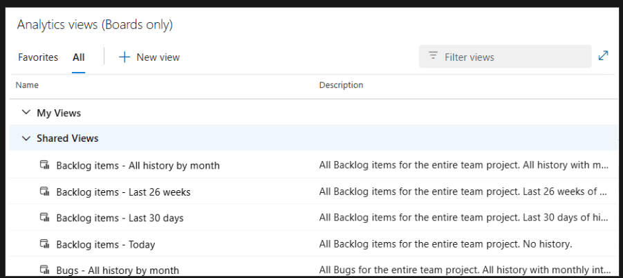
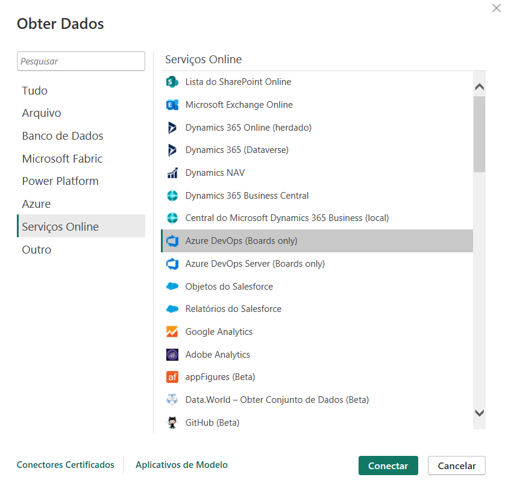
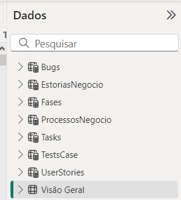

# ELT - Azure Board

## Extrair

- Extrair dados Do Azure Devops via Analytics views

## Carregar

- No PowerBi Obter dados via Azure Devops (boards only)

  Tabela importada 'Visão Geral'

## Transformar

- A partir da tabela 'Visão Geral' criar tabelas virtuais por 'Work Item Type"

Filtros utilizados:

- UserStories = FILTER('Visão Geral', 'Visão Geral'[Work Item Type] = "User Story")
- Bugs = FILTER('Visão Geral', 'Visão Geral'[Work Item Type] = "Bug")
- EstoriasNegocio = FILTER('Visão Geral', 'Visão Geral'[Work Item Type] = "Estória de Negócio")
- Fases = FILTER('Visão Geral', 'Visão Geral'[Work Item Type] = "Fase")
- ProcessosNegocio = FILTER('Visão Geral', 'Visão Geral'[Work Item Type] = "Processo de Negócio")
- Tasks = FILTER('Visão Geral', 'Visão Geral'[Work Item Type] = "Task")
- TestsCase = FILTER('Visão Geral', 'Visão Geral'[Work Item Type] = "Test Case")

