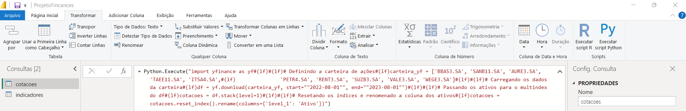
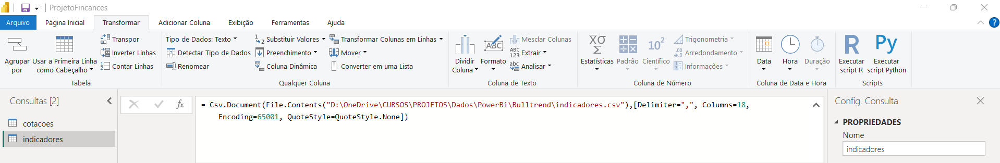
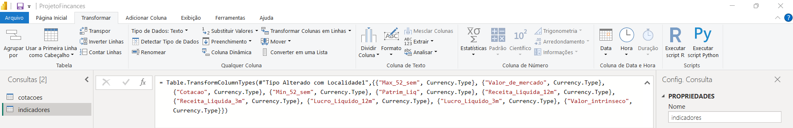
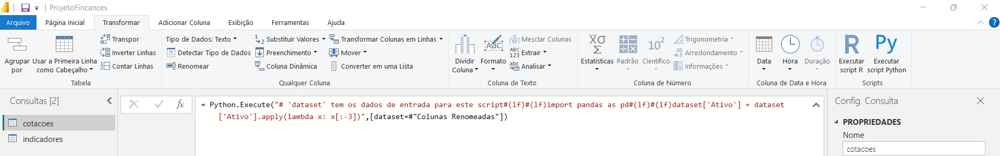
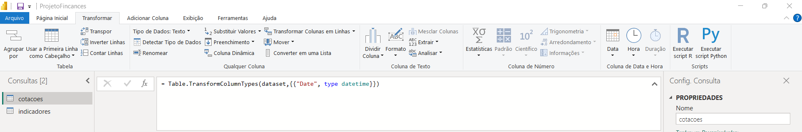
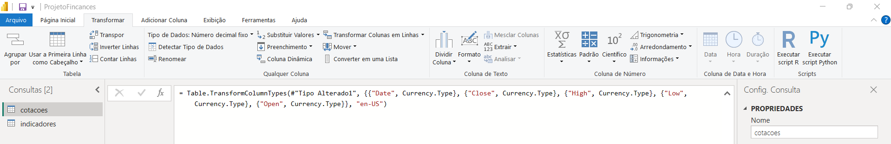
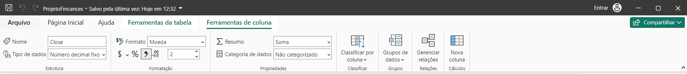

# ELT

## Extrair

- Extrair dados das bases yfinance e fundamentus

## Carregar

- YFinance
  

- Fundamentus
  

## Transformar

### Fundamentos

- Tranformando texto em números, percentual e número decimal fixo (moeda)
  

### YFinance

- Tranformar texto Ativo, retirar o .SA
  

- Transformar em data
  

- Tranformar em número decimal fixo
  

- Ajustar casa decimal
  

- Dashboard PowerBi
  <video controls src="PowerBi-2.mp4" title="Title"></video>
